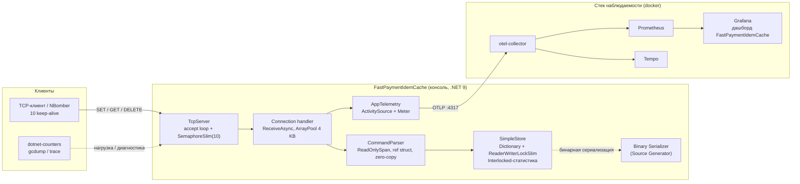
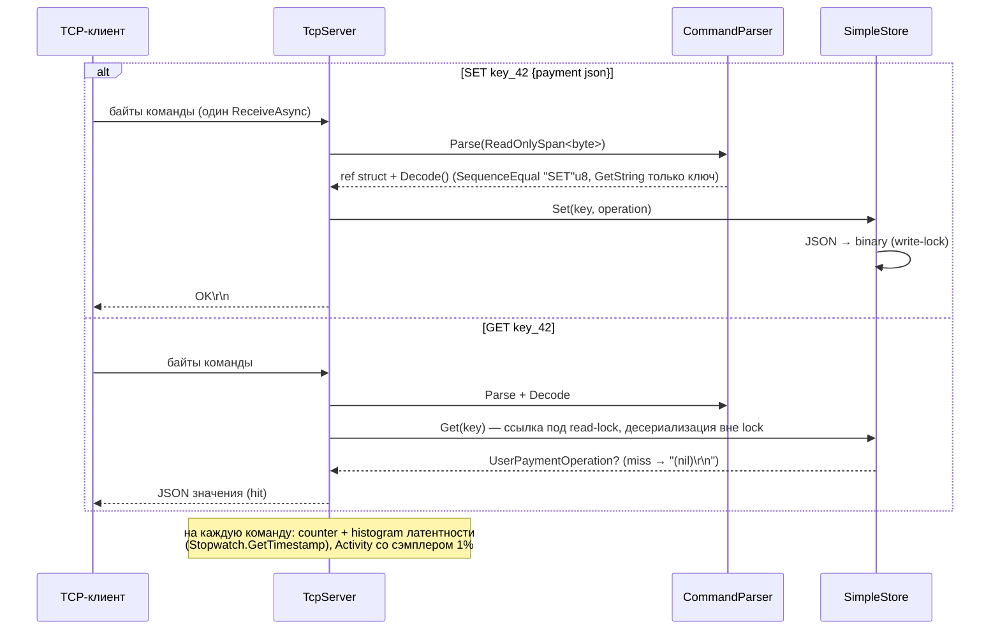

# Fast Payment Idem Cache

**Высокопроизводительный in-memory кэш идемпотентности платежей поверх собственного TCP-протокола.**

Проектная работа курса OTUS «C#. Разработчик. Экспертный уровень». Кэш реализован на **.NET 9**
с async-сокетами и `ArrayPool`, zero-allocation парсером на `ReadOnlySpan<byte>`,
source-generated бинарной сериализацией, `ReaderWriterLockSlim`-хранилищем и полной
наблюдаемостью через OpenTelemetry (метрики + трейсы + дашборд Grafana). Нагрузочное
тестирование — NBomber, микро-бенчмарки — BenchmarkDotNet, диагностика —
dotnet-counters / dotnet-gcdump / dotnet-trace.

---

## Оглавление

- [Структура репозитория](#структура-репозитория)
- [Доменный контекст](#доменный-контекст)
- [Архитектура](#архитектура)
- [Ключевые особенности](#ключевые-особенности)
- [Как запустить](#как-запустить)
- [Результаты](#результаты)
  - [BenchmarkDotNet — сериализация](#benchmarkdotnet--сериализация)
  - [NBomber — нагрузочное тестирование (baseline)](#nbomber--нагрузочное-тестирование-baseline)
  - [До/после оптимизаций](#допосле-оптимизаций)

---

## Структура репозитория

```
otus-homework/
├── src/
│   └── FastPaymentIdemCache/            # TCP-сервер кэша (консоль, .NET 9)
│       ├── Server/                      #   TcpServer: accept-loop, буферы, ветки команд
│       ├── Parser/                      #   CommandParser (ReadOnlySpan, zero-copy)
│       ├── Storage/                     #   SimpleStore (Dictionary + ReaderWriterLockSlim)
│       ├── Models/                      #   UserPaymentOperation, CommandType, парс-результат
│       ├── Observability/               #   AppTelemetry: ActivitySource + Meter
│       └── Program.cs                   #   Конфигурация OTel (трейсы 1%, метрики, runtime)
├── Generators.BinarySerializer/         # Roslyn source generator бинарной сериализации
├── tests/
│   └── FastPaymentIdemCache.Tests/      # xUnit: парсер, хранилище, round-trip сериализации
├── benchmarks/
│   ├── FastPaymentIdemCache.Benchmarks/ # BenchmarkDotNet: JSON vs generated binary
│   └── FastPaymentIdemCache.LoadTests/  # NBomber: stable/max × SET/GET (10 keep-alive)
├── lessons/                             # История домашних заданий курса
└── FastPaymentIdemCache.sln
```

Рабочие материалы проекта — отчёты о прогонах (`docs/results/`), дашборды и скрипты
стека наблюдаемости (`observability/`), материалы презентации (`presentation/`) — ведутся
локально и в git не входят.

## Доменный контекст

Платёж, инициированный через платёжный API, может «зависнуть» на сетевом таймауте:
клиент не получил ответ — но списание на стороне провайдера **могло пройти**. Стандартная
защита — **idempotency key** (механизм Stripe Idempotent Requests, Adyen idempotency):
клиент генерирует уникальный ключ операции, сервер перед выполнением платежа проверяет,
не выполнялась ли уже операция с этим ключом. Ключи хранятся ограниченное время —
типично **24 часа** (окно, в котором клиент имеет право ретраить).

Проверка ключа — **горячий путь каждого платежа**:

- объём — все платежи системы (для среднего процессинга это десятки тысяч RPS);
- латентность — бюджет всего платежа единицы–десятки миллисекунд, проверка ключа
  должна занимать доли миллисекунды;
- предсказуемость — сборки мусора и GC-паузы на горячем пути напрямую удлиняют хвосты
  p99 всех платежей сразу.

In-memory KV-кэш с суб-миллисекундным ответом — подходящее ядро такой проверки:
данные маленькие (ключ + зафиксированный результат операции), читаются многократно
(каждый ретрай), а после окна хранения просто не нужны. Эти требования — латенти,
минимум аллокаций на операцию, минимум GC-пауз — определили инженерный облик проекта:
span-парсер без строк, пулы буферов, source-generated сериализация и измеримость всего.

## Архитектура

Solution из **4 проектов**:

| Проект | Роль |
|---|---|
| `FastPaymentIdemCache` | TCP-сервер кэша: приём соединений, парсер команд, хранилище, телеметрия |
| `Generators.BinarySerializer` | Roslyn source generator: `[GenerateBinarySerializer]` → `SerializeToBinary` / `DeserializeFromBinary` без рефлексии |
| `FastPaymentIdemCache.Tests` | xUnit-тесты: парсер, хранилище, round-trip сериализации, hit/miss пути GET |
| `FastPaymentIdemCache.*Benchmarks*` / `*.LoadTests` | BenchmarkDotNet и NBomber-нагрузка |



Путь команды (sequence, SET и GET):



## Ключевые особенности

**Ядро** (`SimpleStore`):
- `Dictionary<string, byte[]>` — значения хранятся бинарными (32 Б на операцию платежа),
  ключи-строки; объекты домена в куче между операциями не живут.
- `ReaderWriterLockSlim` — множественные читатели GET без конкуренции; GET берёт из
  словаря только ссылку под read-lock, десериализует вне lock (значения иммутабельны —
  Set всегда кладёт новый массив).
- `Interlocked`-счётчики set/get/delete + ObservableGauge `app.store.entries` —
  статистика без блокировок.

**Сеть** (`TcpServer`):
- Async accept-loop на `System.Net.Sockets`, без ASP.NET Core.
- `SemaphoreSlim(10)` — лимит одновременных соединений (измеренная точка «до»);
  каждый handler — отдельная задача.
- `ArrayPool<byte>.Shared.Rent(4097)` на соединение (сообщение ≤ 4 KB + защита от
  превышения — соединение закрывается, ошибка пишется в метрику), возврат буфера в
  `finally`.
- `Socket.ReceiveAsync(Memory<byte>)` — приём без копирования до парсера.

**Протокол и парсер** (`CommandParser`):
- Текстовый протокол: `SET <key> <json>` / `GET <key>` / `DELETE <key>`; один приём
  TCP = одна команда.
- `Parse(ReadOnlySpan<byte>)` возвращает `readonly ref struct CommandParseResult` —
  срези вместо подстрок, ноль аллокаций на разборе.
- `Decode()` сравнивает команду на уровне байтов (`SequenceEqual` с `"SET"u8` /
  `"GET"u8` / `"DELETE"u8` — интернированные константы), `Encoding.UTF8.GetString`
  только для ключа.
- Ответы — статические `byte[]`: `OK\r\n`, `(nil)\r\n`, `-ERR Unknown command\r\n`.

**Сериализация** (`Generators.BinarySerializer`, source generator):
- Атрибут `[GenerateBinarySerializer]` на `partial`-классе модели эмитит
  `SerializeToBinary(Stream)` и `static DeserializeFromBinary(Stream)` —
  BinaryWriter/BinaryReader-код без рефлексии, AOT-friendly.
- Поддерживаемые типы: числовые примитивы, `bool`, `char`, `string`, `decimal`,
  `Guid` (16 байт), `DateTime` (`ToBinary`), перечисления.
- Модель `UserPaymentOperation` (TransactionId Guid, TransactionDate DateTime,
  UserId long) сериализуется в 32 байта против ~110 байт JSON.

**Наблюдаемость** (`AppTelemetry` + Program.cs):
- `ActivitySource "FastPaymentIdemCache"` — span на команду с тегами
  `app.command.type`, `app.command.length.bytes`; сэмплер
  `ParentBased(TraceIdRatioBased(0.01))` — 1% трейсов уходит в Tempo (на 95 500
  команд — 957 трейсов, проверено), аллокационная цена решения отбалансирована.
- `Meter`: counter `app.commands.processed.total`, histogram
  `app.command.execution.time.seconds` (явные бакеты 0.5 мс … 5 с), connections
  current/total, bytes received/sent, protocol errors с причиной
  (`unknown_command` / `invalid_payload` / `exception`), store entries.
- `OpenTelemetry.Instrumentation.Runtime` — GC-поколения, аллокации, куча, паузы.
- OTLP → otel-collector → **Prometheus** (remote-write) + **Tempo**; дашборд Grafana
  (KPI: RPS/p99/аллокации; блок .NET Runtime: Gen0/1/2, LOH, GC-паузы). Контракт
  метрик — `docs/reference/metrics-contract.md` (локальные материалы).

**Диагностика**: методика этапа исследования — `dotnet-counters monitor --counters
System.Runtime` (аллокации/ГЦ в реальном времени, CSV-окна для Б/оп),
`dotnet-gcdump` до/после нагрузки (кто живёт в куче и LOH), `dotnet-trace
--profile gc-verbose` + PerfView `GC Heap Alloc Ref` (стеки аллокаций). Именно эта
цепочка выявила узкие места, закрытые оптимизациями ниже.

## Как запустить

**Требования**: .NET SDK 10 (`net9.0`), Docker — для стека наблюдаемости
(otel-collector, Prometheus `:9091`, Tempo `:3200`, Grafana `:3001`; OTLP-приём на
`:4317/:4318`).

Сервер (Release обязателен — Debug искажает и латентность, и потолок RPS):

```bash
dotnet run -c Release --project src/FastPaymentIdemCache
# FastPaymentIdemCache is ready to listen... → 127.0.0.1:9000
```

Нагрузочные прогоны (NBomber, ключей 100 000, 10 keep-alive соединений; GET-сценарии
запускать после `max-set` — хранилище в памяти процесса):

```bash
dotnet run -c Release --project benchmarks/FastPaymentIdemCache.LoadTests -- stable-set   # 500 RPS, 3 мин
dotnet run -c Release --project benchmarks/FastPaymentIdemCache.LoadTests -- stable-get   # 500 RPS, 3 мин
dotnet run -c Release --project benchmarks/FastPaymentIdemCache.LoadTests -- max-set      # 10 000 RPS, 1 мин
dotnet run -c Release --project benchmarks/FastPaymentIdemCache.LoadTests -- max-get      # 10 000 RPS, 1 мин
```

(В PowerShell вместо одиночного `--` нужен `-- --`.) Отчёты NBomber — HTML/CSV/MD в
`docs/results/nbomber/`.

Микро-бенчмарки и тесты:

```bash
dotnet run -c Release --project benchmarks/FastPaymentIdemCache.Benchmarks   # BenchmarkDotNet
dotnet test                                                                  # 14 кейсов: парсер, хранилище, сериализация
```

## Результаты

Окружение: i5-12400 (6C/12T), 64 ГБ, Windows 11, .NET 9.0.20, Release, loopback,
10 keep-alive соединений. Нагрузка и сервер всегда в одной конфигурации (Release).

### BenchmarkDotNet — сериализация

`UserPaymentOperation` (Guid + DateTime + long, 32 байта в бинарном виде), BenchmarkDotNet
v0.15.7, MemoryDiagnoser:

| Method | Mean | Ratio | Allocated | Alloc Ratio |
|---|---:|---:|---:|---:|
| `SystemTextJson` (baseline) | 217.21 ns | 1.00 | 672 B | 1.00 |
| `GenerateBinary` | **65.65 ns** | **0.30** | **440 B** | **0.65** |

**Ключевые выводы: генераторная бинарная сериализация в 3.3 раза быстрее JSON и
использует на 35% меньше аллокаций; ноль рефлексии (AOT-friendly), код инлайнится JIT.**

### NBomber — нагрузочное тестирование (baseline)

Точка «до» оптимизаций (полный отчёт — `docs/reports/baseline.md`, локальные материалы).
Stable-нагрузка (500 RPS, 3 мин, по 90 000 команд на прогон, 0 отказов):

| Команда | RPS | p50 | p95 | p99 | Аллокации |
|---|---:|---:|---:|---:|---:|
| SET | 500 | 0.23 ms | 0.74 ms | 2.01 ms | 1212 Б/оп |
| GET | 500 | 0.22 ms | 0.53 ms | 1.23 ms | 1099 Б/оп |

Потолок пропускной способности (лестница подачи, ok-RPS на момент останова; отказы при
перегрузке — клиентские 10-с таймауты, это и есть сигнал потолка):

| Подача | SET ok RPS | GET ok RPS |
|---:|---:|---:|
| 40 000 | полное усвоение | — |
| 60 000 | ≈52 100 (пик, останов на 47-й с) | 60 000 (полное усвоение) |
| 80 000 | 22 600 (коллапс) | 30 100 (коллапс) |

**Ключевые выводы: потолок одного процесса ≈ 52k SET / ≥60k GET ok-RPS на 10
keep-alive соединениях; Б/оп стабилен по лестнице нагрузки (1.2–1.6 КБ/оп); при
подаче выше потолка пропускная способность падает (congestion collapse), а не
стабилизируется.**

### До/после оптимизаций

Оптимизации: (1) сэмплер трейсов 1% + безаллокационный тайминг
`Stopwatch.GetTimestamp()` вместо `Stopwatch`; (2) байтовый декодер команд — сравнение
с UTF8-константами, `GetString` только для ключа, строковые константы без бокса в
тегах метрик; (3) генераторная десериализация GET (`DeserializeFromBinary` вне
read-lock). Замер — A/B обоих кодов в один день (git-worktree точки «до»),
стационарное окно 60 с (полный отчёт — `docs/reports/after.md`):

| Метрика | «до» | «после» | Δ |
|---|---:|---:|---|
| SET, аллокации | 1291.7 Б/оп | 1079.0 Б/оп | **−16.5%** |
| GET, аллокации | 1092.2 Б/оп | 898.2 Б/оп | **−17.8%** |
| GET p99 (500 RPS) | 0.85 ms | 0.34 ms | **×2.5 ниже** |
| GET Gen2 @60k RPS | 4/мин | 0/мин | GC-паузы 0.53→0.14 с/мин |
| SET p50 @60k RPS (полное усвоение) | 4481 ms | 875 ms | **×5.1 ниже** |
| ok-RPS @80k (перегрузка) | SET 16.6k / GET 20.1k | **SET 31.3k / GET 40.0k** | **×1.9–2.0** |

**Ключевые выводы: при одинаковой полной нагрузке 60k RPS обе версии справляются, но
оптимизированная держит очередь в 5 раз короче (SET p50 4.5 с → 0.9 с) и вдвое меньше
отказов при перегрузке; на стабильной нагрузке аллокации упали на ~17% у обеих команд,
а GET-путь ускорился по p99 в 2.5 раза.**